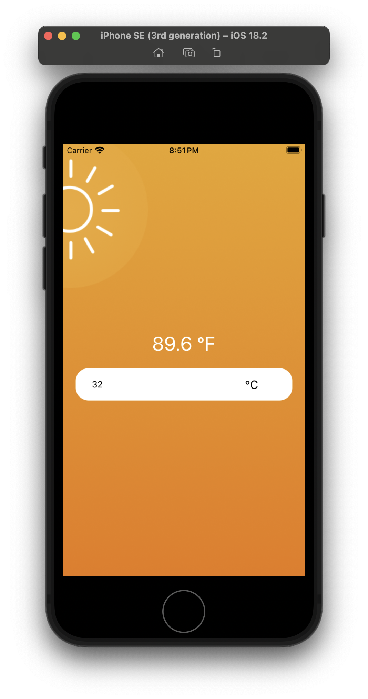
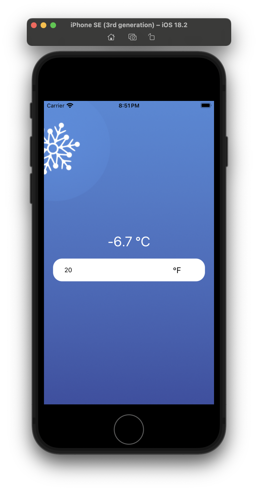

# Temperature Converter App

This is an awesome temperature converter app that dynamically changes the background.

## Features

1. **Interactive Input:** Users can enter temperature values, and the app dynamically updates the conversion.
2. **Unit Toggle:** Switch between Celsius (°C) and Fahrenheit (°F) with a single tap.
3. **Dynamic Background:** The app background changes to reflect hot or cold temperatures.

## Screenshots

| Hot | Cold | 
| ---- | ---- |
|  |  |

